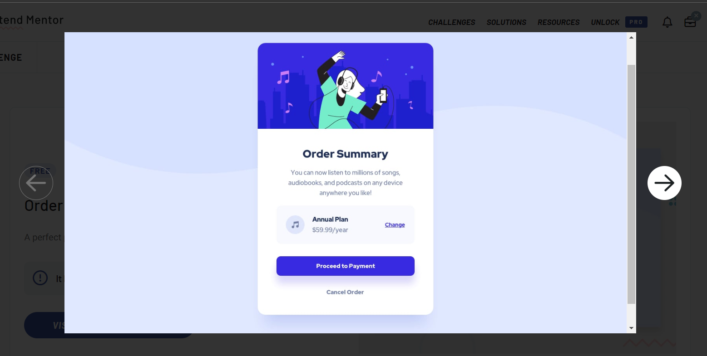

# Projeto card de música 
 Projeto do card de plano de assinatura de site de música com intuito de aprimorar os aprendizados e estudar.

 ## Imagem do projeto do Frontend Mentor usado como base

 ## Tecnologias utilizadas
 - HTML
 - CSS

 ## Fonte e tamanho da letra
- Family: [Red Hat Display](https://fonts.google.com/specimen/Red+Hat+Display)
- Weights: 500, 700, 900